# Black-Friday-Sales
Our dataset is comprised of sales transactions captured at a retail store on “Black Fridays.” It has 550,069 rows and 12 columns. Our primary goal is to predict purchase amount using the data features, thus using the dataset to form a regression problem. Customers will be split into two classes (i.e. the Big Spenders and Small Buyers; aka High/Low spending classes). We expect to improve our understanding of customer behavior from an examination of multiple shopping experiences and to build a report that can highlight our engineering skills for future employers.

# Code
## Basic Data Exploration

```
df_unique_Users <- df %>% group_by(User_ID) %>% 
  summarise(Gender = Gender[1], 
            Age = Age[1], 
            Occupation = Occupation[1], 
            City_Category = City_Category[1], 
            Stay_In_Current_City_Years = Stay_In_Current_City_Years[1], 
            Marital_Status = Marital_Status[1], 
            Purchase = sum(Purchase), 
            Items_Count = n())
#View Data
dim(df)s
dim(df_unique_Users) #Number of Unique Users = 5891   Number of columns = 9

head(df, 20) 
head(df_unique_Users, 20)

str(df) 
str(df_unique_Users)

plot_str(df) # To create a Network Graph for our data set
plot_str(df_unique_Users)
```
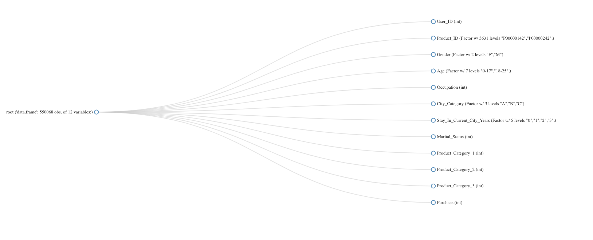


```
sapply(df, function(x) sum(is.na(x))) 
plot_missing(df)
```
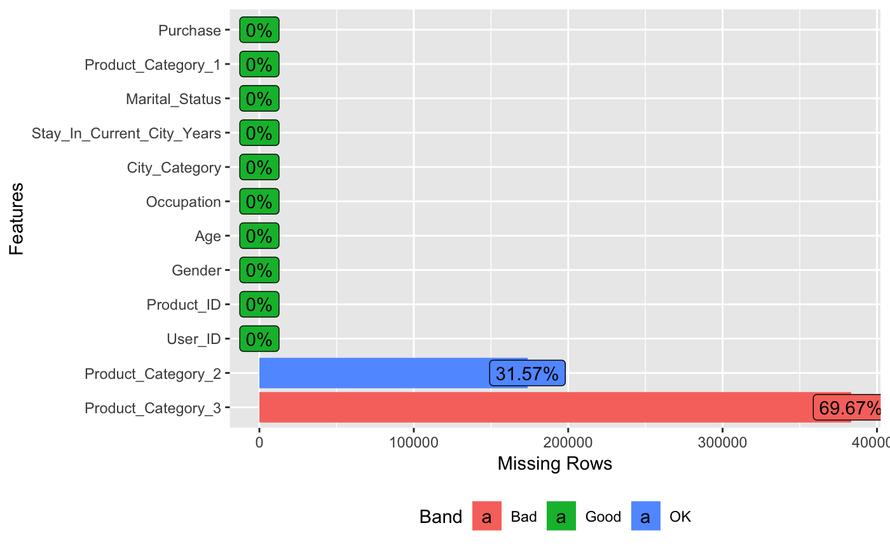

```
#********BASIC DATA EXPLORATION CONTINUE*********#
#Our Data set Distribution. i.e. #Who shopped more?
prop.table(table(df$Marital_Status))  #Married? Unmarried?
prop.table(table(df$Gender)) #Male vs Female?
prop.table(table(df$Age)) #Age group?
prop.table(table(df$City_Category)) #City_Category with the highest customers?
prop.table(table(df$Stay_In_Current_City_Years)) #Does duration of city stay play a role?

#Histogram showing Distributions of all Continuous Features
hist(df$Purchase, 
     main="Distribution of Purchase",
    xlab="Amount ($)",
    col="darkmagenta",
    )
hist(df$Occupation, 
     main="Distribution of Occupation",
    xlab="Occupation ID",
    col="blue",
    )
hist(df$Product_Category_1, 
     main="Distribution of Product_Category_1",
    xlab="Product_Category_1",
    col="green",
    )
hist(df$Product_Category_2, 
     main="Distribution of Product_Category_2",
    xlab="Product_Category_2",
    col="red",
    )
hist(df$Product_Category_3, 
     main="Distribution of Product_Category_3",
    xlab="Product_Category_3",
    col="orange",
    )
hist(df$User_ID, 
     main="Distribution of User_ID",
    xlab="User_ID",
    col="chocolate",
    )
              
#Bar graphs showing Distributions of all Descrete Features
plot_bar(df, ) #Bar graphs showing Distributions of all Descrete Features
```
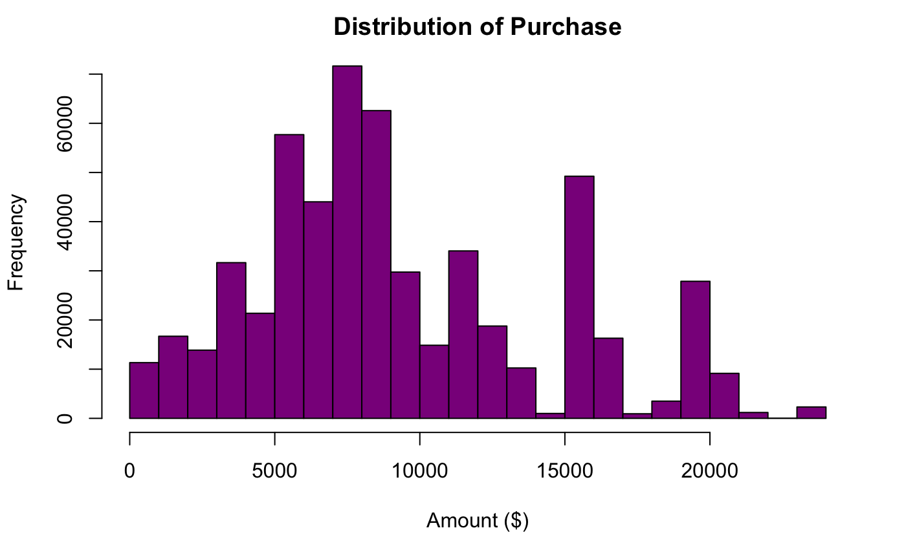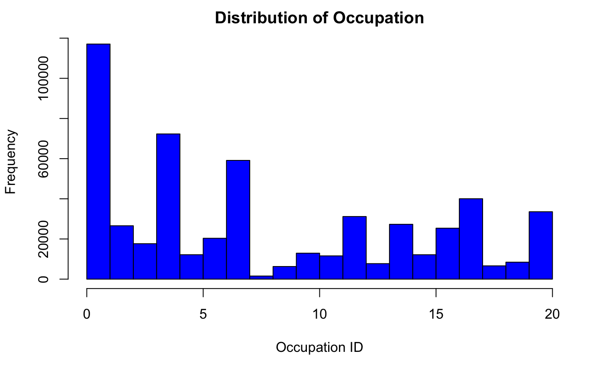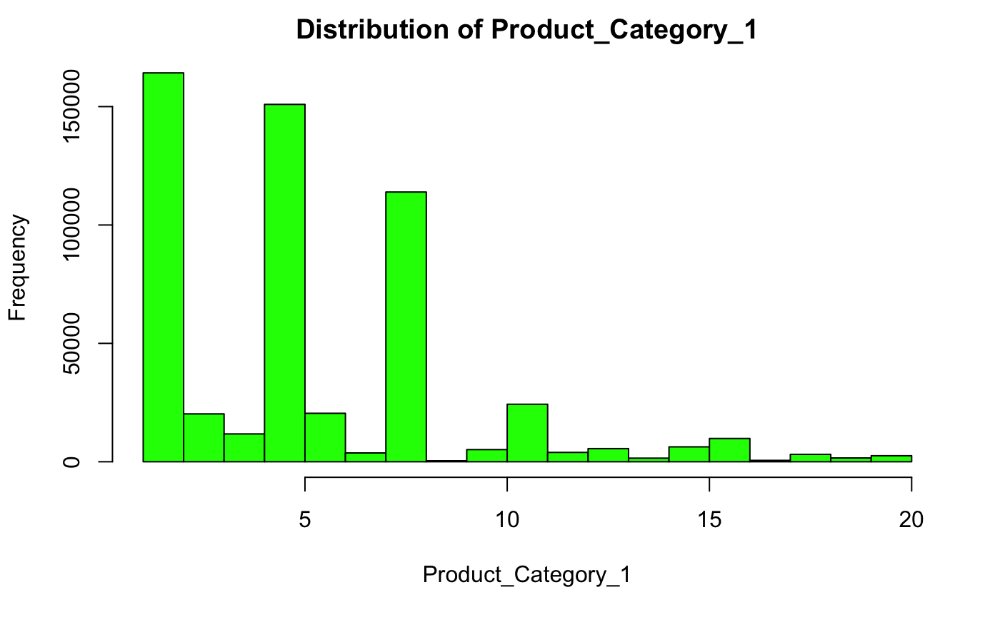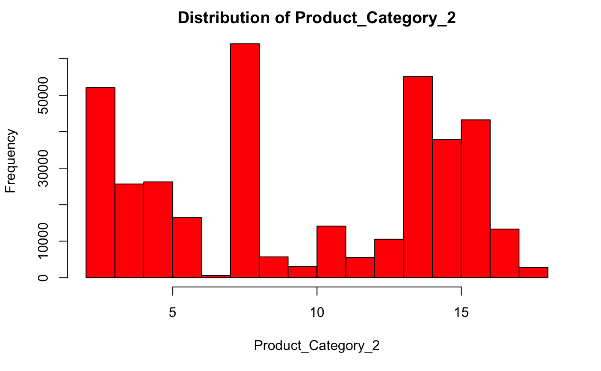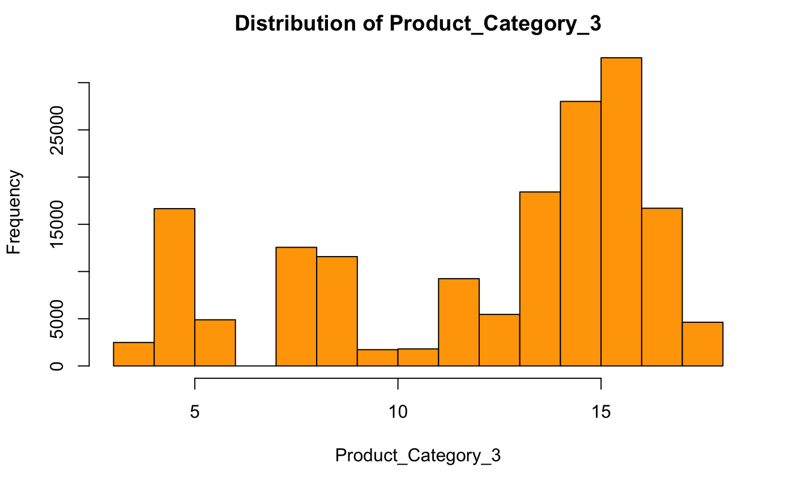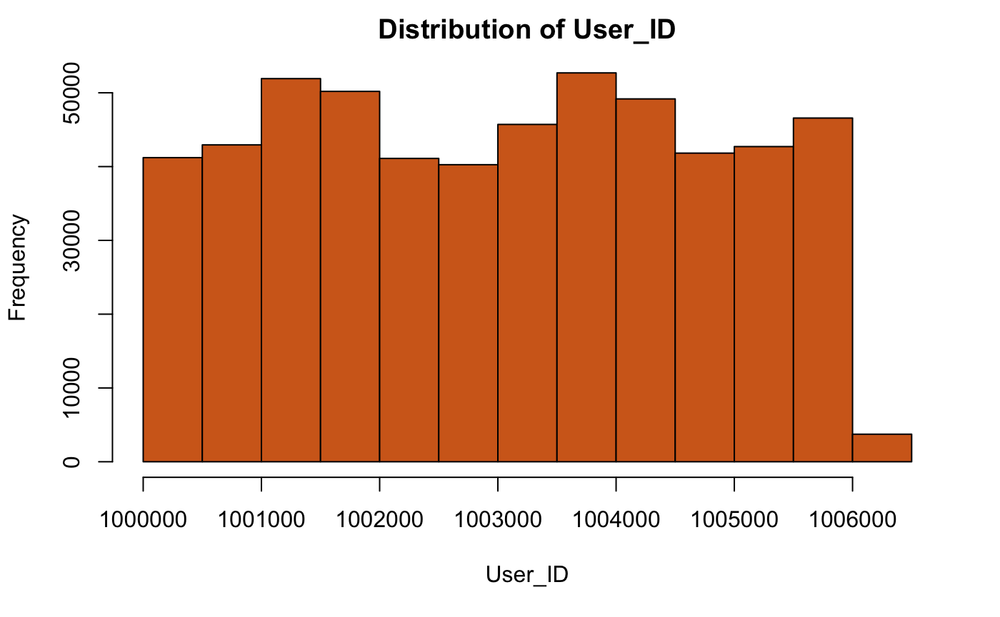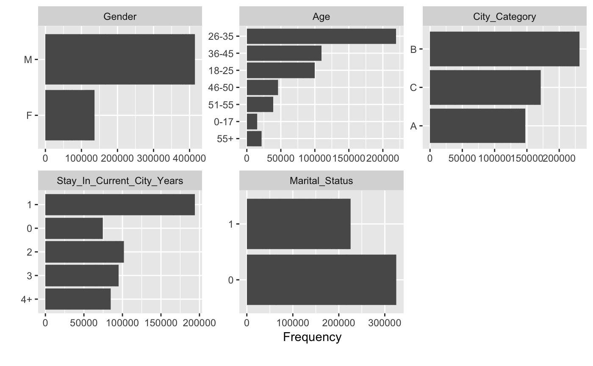
```
#**********DATA PRE-PROCESSING*********
# Type Conversions
df$User_ID <- as.factor(df$User_ID)
df$Product_ID <- as.factor(df$Product_ID)
df$Gender <- as.factor(if_else(df$Gender == 'M', 'Male', 'Female'))
df$Age <- as.factor(df$Age)
df$Occupation <- as.factor(df$Occupation)
df$City_Category <- as.factor(df$City_Category)
df$Stay_In_Current_City_Years <- as.factor(df$Stay_In_Current_City_Years)
df$Marital_Status <- as.factor(if_else(df$Marital_Status == 1, 'Married', 'Single'))
df$Product_Category_1 <- as.integer(df$Product_Category_1)
df$Product_Category_2 <- as.integer(df$Product_Category_2)
df$Product_Category_3 <- as.integer(df$Product_Category_3)
df$Purchase <- as.numeric(df$Purchase)

#For Product_Category_2
fix_PC2<-rpart(Product_Category_2 ~ User_ID+Product_ID+Age+Gender, data=df[!is.na(df$Product_Category_2),], method="anova")
df$Product_Category_2[is.na(df$Product_Category_2)] <- predict(fix_PC2, df[is.na(df$Product_Category_2),])

#For Product_Category_3
fix_PC3<-rpart(Product_Category_3 ~ User_ID+Product_ID+Age+Gender, data=df[!is.na(df$Product_Category_3),], method="anova")
df$Product_Category_3[is.na(df$Product_Category_3)] <- predict(fix_PC3, df[is.na(df$Product_Category_3),])

head(df,10)
summary(df)
dim(df) #After pre-processing, our data set still has 537577 rows and 12 columns. i.e. no data loss
plot_missing(df) #Once again, check for missing values
```
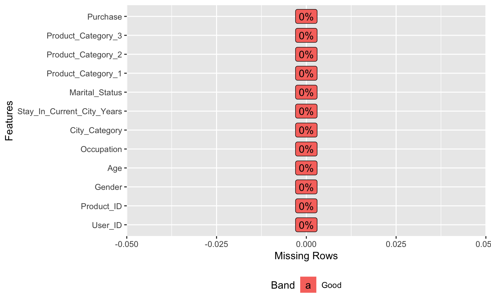
```
#### Do some Univariate Analysis
stat_function = function(x){
    if(class(x)=="integer"|class(x)=="numeric"){
        var_type = class(x)
        length = length(x)
        miss_val = sum(is.na(x))
        mean = mean(x,na.rm = T)
        std = sd(x,na.rm = T)
        var = var(x,na.rm = T)
        cv = std/mean
        min = min(x)
        max = max(x,na.rm = T)
        pct = quantile(x,na.rm = T,p=c(0.75,0.85,0.90,0.95,0.99,1.0))
        return(c(var_type=var_type,length=length,miss_val=miss_val,mean=mean,std=std,var=var,cv=cv,min=min,max=max,pct=pct))
        }
}
#####Name of a numeric variable and categorical (factor)variable
num_var = names(df)[sapply(df,is.numeric)]
cat_var = names(df)[!sapply(df,is.numeric)]
###
#
mystat = apply(df[num_var],2,stat_function)
t(mystat)
###Checking for Outliers
options(scipen = 9999)
boxplot(df[num_var],horizontal = T,col = rainbow(1:10))
```
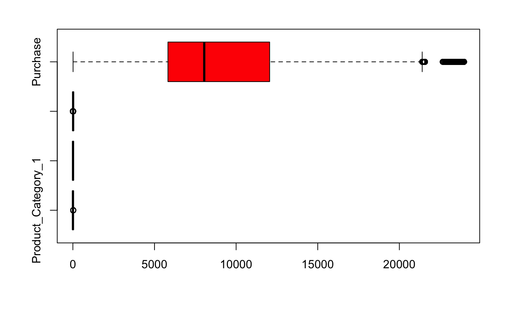
## Linear Regression
```
##Dropping dependent variable values to be predicted
df1<-df_unique_Users
df1$User_ID <- NULL
df1$Product_ID <- NULL

##Dividing data into training and testing
sample = sample(1:nrow(df1),size = floor(nrow(df1)*0.7))
train = df1[sample,]
test = df1[-sample,]
##Start to build the model
lm_fit = lm(log(Purchase)~., data = train)
summary(lm_fit)
plot(lm_fit)
###
pred <- predict(lm_fit, test, interval="confidence")
actual <- log(test$Purchase) 
rmse <- (mean((pred - actual)^2))^0.5
rmse
#AIC(pred)
#confusionMatrix(log(test$Purchase), actual, pred, dnn=list('actual','predicted'))# estimate = `Linear regression`)
#table(actual, pred, dnn=list('actual','predicted'))

#pred
plot(pred)
```
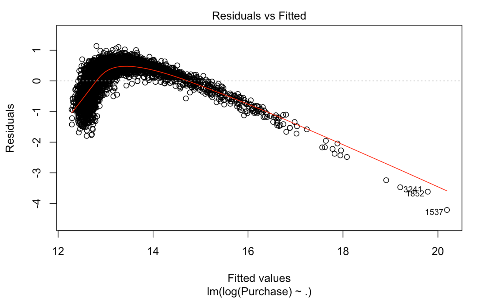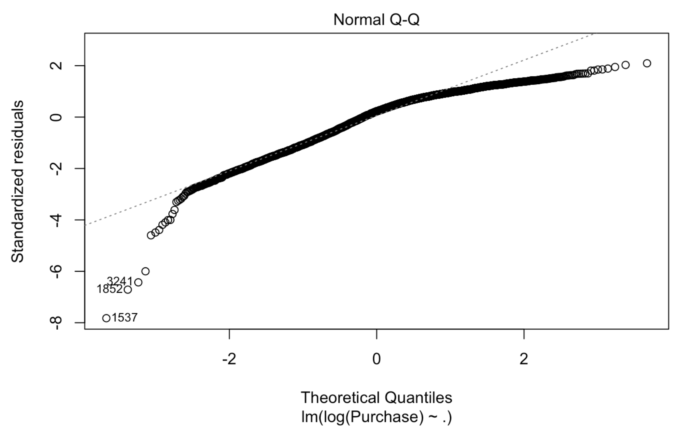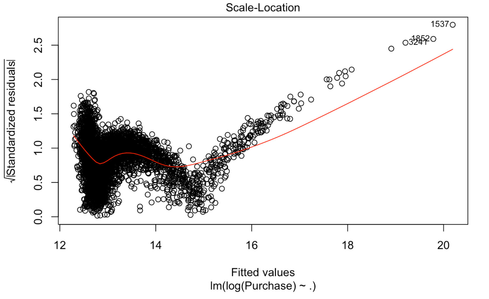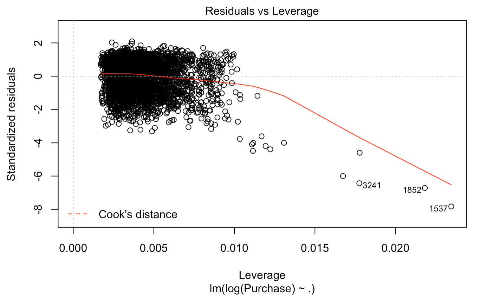
```
#************ RIDGE REGRESSION FEATURE SELECTION**************#
library(glmnet)
x=model.matrix(df1$Purchase ~ ., df1)
#y=log(df1$Purchase) #Log Transformed Purchases gave a negative Lambda
y=df1$Purchase

grid=10^seq(10,-2,length=100) #Creates a sequence of 100 λ values
ridge_model=glmnet(x, y, alpha=0, lambda=grid)#Remember that α = 0 is for ridge regression
dim(coef(ridge_model)) #This give 18 coefficients 100 λ values
ridge_model$lambda[50] #811130831 is the 10th lambda location
coef(ridge_model)[,50] #Gives the coefficients at high λ values
sqrt(sum(coef(ridge_model)[-1,50]^2)) # [1] 105775.9 - This is the Shrinkage penalty
ridge_model$lambda[60] # Notice the smaller value of lambda
coef(ridge_model)[,60] #Now, notice the coefficients are larger
sqrt(sum(coef(ridge_model)[-1,60]^2)) #[1] 118170.6 is the new shrinkage penalty
predict(ridge_model, s=50, type = "coefficients")[1:18,] #Predict coefficients at new value of λ=50

#******FINDING BEST LAMBDA***************#
set.seed(1)
train = sample(1:nrow(x), nrow(x)/2)
test = (-train)
y_test=y[test]
ridge_model=glmnet(x[train,], y[train], alpha=0, lambda=grid, thresh = 1e-12)
ridge_pred=predict(ridge_model, s=8, newx=x[test,], type = "coefficients")[1:18,]
ridge_pred
cv_out=cv.glmnet(x[train,], y[train], alpha=0) #We have used the Default is 10-fold cross-validation
plot(cv_out)
plot(ridge_model)

#See the plot below, our Most regularized model has a mean squared error (MSE) That is not within one standard error of the minimal
best_lambda=cv_out$lambda.min #This is showing us the best lambda value
best_lambda
out=glmnet(x,y,alpha=0)
predict(out,type="coefficients",s=best_lambda)[1:18,]
```
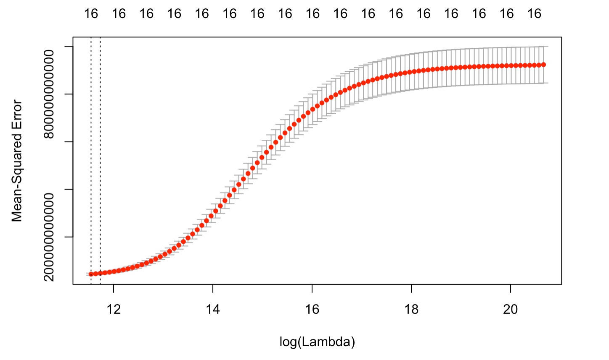
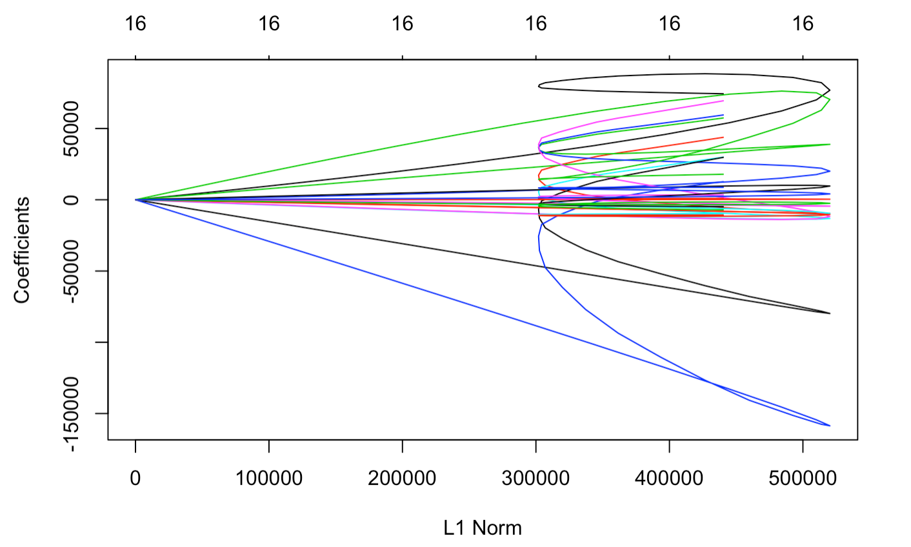
