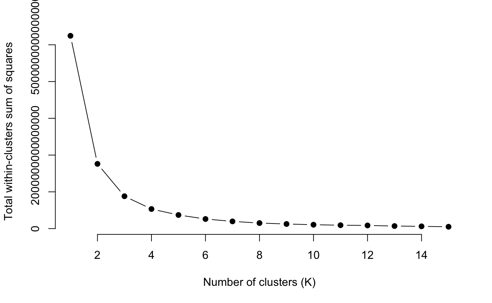

# Black-Friday-Sales
This study examines shopping that is done on “Black Friday,” routinely the busiest shopping day of the year in the United States.  The primary research question was to predict and describe who were the biggest spenders during this shopping event.  The purpose is to utilize these findings to better inform and focus retail marketing efforts.  It is significant because for many retailers this shopping day can mean the difference between a profit and a loss for the fiscal quarter, and sometimes the fiscal year.  The biggest spenders during “Black Friday” are generally  males, between the ages of 26 to 35.  They are most likely to spend over $2000- on specific product classes.  Specific product identification numbers are good predictors of who will spend the most.  It is interesting to note that the biggest spenders were younger males, which is contrary to popular U.S. stereotypes.  
Our dataset is comprised of sales transactions captured at a retail store on “Black Fridays.”  It has 537,577 rows and 12 columns. predict purchase amount using the data features, thus using the dataset to form a regression problem. Customers will be split into two classes (i.e. the Big Spenders and Small Buyers; aka High/Low spending classes).  Customer behavior is explained from this examination of  multiple shopping experiences.  


# Code
## Basic Data Exploration
### Data Structure
The data source is named the Black Friday data set and it was obtained from Kaggle.com and originally utilized as part of a competition on the Analytics Vidhya website. It is a sample of the transactions made in a retail store. The data was utilized to better understand customer purchase behavior against different products. The various algorithms, with an emphasis on regression,  were used to predict the dependent variable (the amount of purchase) with the help of the information contained in the other variables. Classifications were also accomplished with this  dataset since several variables are categorical. The approaches were "Predicting the age of the consumer" and "Predict the category of goods bought.” This dataset is amenable to clustering so different clusters were determined.
```
df_unique_Users <- df %>% group_by(User_ID) %>% 
  summarise(Gender = Gender[1], 
            Age = Age[1], 
            Occupation = Occupation[1], 
            City_Category = City_Category[1], 
            Stay_In_Current_City_Years = Stay_In_Current_City_Years[1], 
            Marital_Status = Marital_Status[1], 
            Purchase = sum(Purchase), 
            Items_Count = n())
#View Data
dim(df)s
dim(df_unique_Users) #Number of Unique Users = 5891   Number of columns = 9

head(df, 20) 
head(df_unique_Users, 20)

str(df) 
str(df_unique_Users)

plot_str(df) # To create a Network Graph for our data set
plot_str(df_unique_Users)
```


### Data Pre-prosessing: Missing Value
```
sapply(df, function(x) sum(is.na(x))) 
plot_missing(df)
```


```
#For Product_Category_2
fix_PC2<-rpart(Product_Category_2 ~ User_ID+Product_ID+Age+Gender, data=df[!is.na(df$Product_Category_2),], method="anova")
df$Product_Category_2[is.na(df$Product_Category_2)] <- predict(fix_PC2, df[is.na(df$Product_Category_2),])

#For Product_Category_3
fix_PC3<-rpart(Product_Category_3 ~ User_ID+Product_ID+Age+Gender, data=df[!is.na(df$Product_Category_3),], method="anova")
df$Product_Category_3[is.na(df$Product_Category_3)] <- predict(fix_PC3, df[is.na(df$Product_Category_3),])

head(df,10)
summary(df)
dim(df) #After pre-processing, our data set still has 537577 rows and 12 columns. i.e. no data loss
plot_missing(df) #Once again, check for missing values
```

### Data Pre-prosessing:Type Conversions
```
df$User_ID <- as.factor(df$User_ID)
df$Product_ID <- as.factor(df$Product_ID)
df$Gender <- as.factor(if_else(df$Gender == 'M', 'Male', 'Female'))
df$Age <- as.factor(df$Age)
df$Occupation <- as.factor(df$Occupation)
df$City_Category <- as.factor(df$City_Category)
df$Stay_In_Current_City_Years <- as.factor(df$Stay_In_Current_City_Years)
df$Marital_Status <- as.factor(if_else(df$Marital_Status == 1, 'Married', 'Single'))
df$Product_Category_1 <- as.integer(df$Product_Category_1)
df$Product_Category_2 <- as.integer(df$Product_Category_2)
df$Product_Category_3 <- as.integer(df$Product_Category_3)
df$Purchase <- as.numeric(df$Purchase)
```
### Data Distribution
```
prop.table(table(df$Marital_Status))  #Married? Unmarried?
prop.table(table(df$Gender)) #Male vs Female?
prop.table(table(df$Age)) #Age group?
prop.table(table(df$City_Category)) #City_Category with the highest customers?
prop.table(table(df$Stay_In_Current_City_Years)) #Does duration of city stay play a role?

#Histogram showing Distributions of all Continuous Features
hist(df$Purchase, 
     main="Distribution of Purchase",
    xlab="Amount ($)",
    col="darkmagenta",
    )
hist(df$Occupation, 
     main="Distribution of Occupation",
    xlab="Occupation ID",
    col="blue",
    )
hist(df$Product_Category_1, 
     main="Distribution of Product_Category_1",
    xlab="Product_Category_1",
    col="green",
    )
hist(df$Product_Category_2, 
     main="Distribution of Product_Category_2",
    xlab="Product_Category_2",
    col="red",
    )
hist(df$Product_Category_3, 
     main="Distribution of Product_Category_3",
    xlab="Product_Category_3",
    col="orange",
    )
hist(df$User_ID, 
     main="Distribution of User_ID",
    xlab="User_ID",
    col="chocolate",
    )
              
#Bar graphs showing Distributions of all Descrete Features
plot_bar(df, ) #Bar graphs showing Distributions of all Descrete Features
```


```
#### Do some Univariate Analysis
stat_function = function(x){
    if(class(x)=="integer"|class(x)=="numeric"){
        var_type = class(x)
        length = length(x)
        miss_val = sum(is.na(x))
        mean = mean(x,na.rm = T)
        std = sd(x,na.rm = T)
        var = var(x,na.rm = T)
        cv = std/mean
        min = min(x)
        max = max(x,na.rm = T)
        pct = quantile(x,na.rm = T,p=c(0.75,0.85,0.90,0.95,0.99,1.0))
        return(c(var_type=var_type,length=length,miss_val=miss_val,mean=mean,std=std,var=var,cv=cv,min=min,max=max,pct=pct))
        }
}
#####Name of a numeric variable and categorical (factor)variable
num_var = names(df)[sapply(df,is.numeric)]
cat_var = names(df)[!sapply(df,is.numeric)]
###
#
mystat = apply(df[num_var],2,stat_function)
t(mystat)
###Checking for Outliers
options(scipen = 9999)
boxplot(df[num_var],horizontal = T,col = rainbow(1:10))
```

## Linear Regression
Started from simple linear regression to do the prediction. In the model, we have set unless dependent variables null and selected variables like gender, age, occupation, years in current city, marital status and items count. The adjusted R-squared value is 0.6915.

```
##Dropping dependent variable values to be predicted
df1<-df_unique_Users
df1$User_ID <- NULL
df1$Product_ID <- NULL

##Dividing data into training and testing
sample = sample(1:nrow(df1),size = floor(nrow(df1)*0.7))
train = df1[sample,]
test = df1[-sample,]
##Start to build the model
lm_fit = lm(log(Purchase)~., data = train)
summary(lm_fit)
plot(lm_fit)
###
pred <- predict(lm_fit, test, interval="confidence")
actual <- log(test$Purchase) 
rmse <- (mean((pred - actual)^2))^0.5
rmse
#AIC(pred)
#confusionMatrix(log(test$Purchase), actual, pred, dnn=list('actual','predicted'))# estimate = `Linear regression`)
#table(actual, pred, dnn=list('actual','predicted'))

#pred
plot(pred)
```


We plotted the residuals vs. fitted values as a useful way to check linearity and homoscedasticity. There are some large negative residual values at bottom right corner of the plot which means that these values do not meet the linear model assumption. To assess the assumption of linearity, we hope to ensure that the residuals are between -2 and 2. And we deleted those values not located in this range. 
The residuals vs. leverage plots also helps us to identify the influential data in our model. The 
points we are not looking for are those in the upper right or lower right. From the plot, we can see some outliers in the lower right corner which tend to have a critical impact on our model, so we remove these values to reach unbiased results. 

```
#************ RIDGE REGRESSION FEATURE SELECTION**************#
library(glmnet)
x=model.matrix(df1$Purchase ~ ., df1)
#y=log(df1$Purchase) #Log Transformed Purchases gave a negative Lambda
y=df1$Purchase

grid=10^seq(10,-2,length=100) #Creates a sequence of 100 λ values
ridge_model=glmnet(x, y, alpha=0, lambda=grid)#Remember that α = 0 is for ridge regression
dim(coef(ridge_model)) #This give 18 coefficients 100 λ values
ridge_model$lambda[50] #811130831 is the 10th lambda location
coef(ridge_model)[,50] #Gives the coefficients at high λ values
sqrt(sum(coef(ridge_model)[-1,50]^2)) # [1] 105775.9 - This is the Shrinkage penalty
ridge_model$lambda[60] # Notice the smaller value of lambda
coef(ridge_model)[,60] #Now, notice the coefficients are larger
sqrt(sum(coef(ridge_model)[-1,60]^2)) #[1] 118170.6 is the new shrinkage penalty
predict(ridge_model, s=50, type = "coefficients")[1:18,] #Predict coefficients at new value of λ=50

#******FINDING BEST LAMBDA***************#
set.seed(1)
train = sample(1:nrow(x), nrow(x)/2)
test = (-train)
y_test=y[test]
ridge_model=glmnet(x[train,], y[train], alpha=0, lambda=grid, thresh = 1e-12)
ridge_pred=predict(ridge_model, s=8, newx=x[test,], type = "coefficients")[1:18,]
ridge_pred
cv_out=cv.glmnet(x[train,], y[train], alpha=0) #We have used the Default is 10-fold cross-validation
plot(cv_out)
plot(ridge_model)

#See the plot below, our Most regularized model has a mean squared error (MSE) That is not within one standard error of the minimal
best_lambda=cv_out$lambda.min #This is showing us the best lambda value
best_lambda
out=glmnet(x,y,alpha=0)
predict(out,type="coefficients",s=best_lambda)[1:18,]
```


```
#********Clustering: Finding the Best K using Elbow Method***************#
df2<- df_unique_Users #Use df_unique_Users dataset because it creates clusters by User_id not by transactions
df2$Marital_Status <- ifelse(df2$Marital_Status == 'Married',1,0)
df2$Gender <- ifelse(df2$Gender == 'Female',1,0)
df2$Age <- ifelse(df2$Age == '0-17',1,df$Age)
#df2$Purchase <- NULL
levels(df2$City_Category)[levels(df2$City_Category) == "A"] <- 1
levels(df2$City_Category)[levels(df2$City_Category) == "B"] <- 2
levels(df2$City_Category)[levels(df2$City_Category) == "C"] <- 3
df2$City_Category <- as.integer(df2$City_Category)
df2$Occupation <- as.numeric(df2$Occupation)
df2$Stay_In_Current_City_Years <- as.numeric(df2$Stay_In_Current_City_Years)

df2$Occupation <- scale(df2$Occupation)
df2$Stay_In_Current_City_Years <- scale(df2$Stay_In_Current_City_Years)
df2$Age <- scale(df2$Age)
df2$City_Category <- scale(df2$City_Category)

k.max <- 15
data <- df2
wss <- sapply(1:k.max,function(k){kmeans(data, k, nstart=50,iter.max = 15 )$tot.withinss})
#wss
plot(1:k.max, wss,
     type="b", pch = 19, frame = FALSE, 
     xlab="Number of clusters (K)",
     ylab="Total within-clusters sum of squares")

```

```
